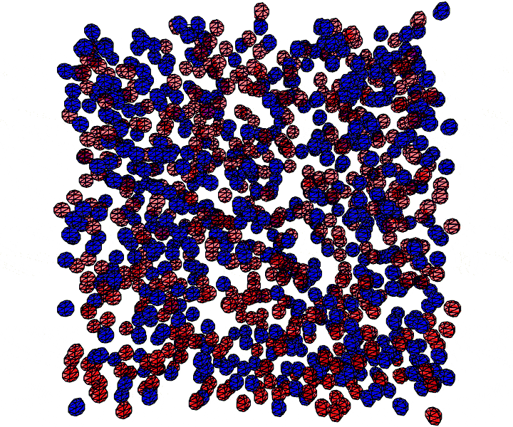

# Self-organisation simulation

An agent-based 3D simulation of random cell motion and aggregation, modelling how dissociated (disaggregated) cells self-organise into structured aggregates. Cells move and interact locally, and adhesion between them drives sorting and aggregation; an octree spatial structure keeps the neighbour interactions efficient as cell numbers grow. The simulation includes a configurable model specification and an interactive UI.

Developed for [Lefevre et al. (2017), *Development* 144(6):1087–1096](https://journals.biologists.com/dev/article-abstract/144/6/1087/48348).

## The model

Simulated cells undergo random (Brownian) motion and local interaction. Pairwise adhesion bonds form between proximate cells of one class (blue above, modelling ureteric epithelial cells). These bonds then act in a spring-like way to maintain contact  between the cells, but may be broken by sufficient separation. An exclusion force (short range repulsion) keeps cells separate.

The purpose of the simulation is to demonstrate that these modelled mechanisms are sufficient to explain observed self-organisation of disaggregated embryonic mouse kidney cells in culture (ureteric epithelium and cap mesenchyme, modelled above as blue and red cells respectively), without any additional mechanism such as chemotaxis. In culture, the emergent clusters eventually develop cell orientation and mature structure, but that is beyond the scope of this simulation.

Outputs of the simulation are the live 3D viewing feature, screenshots (including sequences which can be assembled into movies), and tabular data giving complete cell level information at specified time points. In the study, simulated cell size, population densities and rate of movement were calibrated to measurements from cell culture microscopy. This allowed qualitative and quantitative comparisons between the cell culture and simulation across time, including cluster size distributions and the Ripley’s K statistic.

## Running it

This is a [Processing](https://processing.org/) sketch. Install Processing 4 and the peasycam library, run the Processing app, use it to open the file self_organisation_sim.pde in the folder of the same name, make any desired code adjustments, then click the run button.  See the **[user guide](USER_GUIDE.md)** for details including controls, parameters and options.

## Built with

Processing (a Java-based environment for visual and interactive applications).

## License

Released under the MIT License — see [LICENSE.txt](LICENSE.txt).
